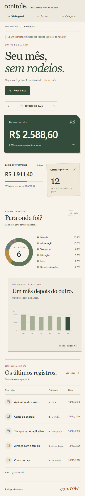

# A interface

Um caderno para as contas do dia a dia. A direção visual mistura papel claro, verde fechado e pequenos detalhes em terracota. Os títulos usam Georgia; o corpo usa Segoe UI, com alternativas locais. Não há download de fontes nem biblioteca de interface.

## Arquivos para editar

| Arquivo | O que fica nele |
|---|---|
| [index.html](src/main/resources/static/index.html) | Estrutura, textos, navegação, tabelas e formulários |
| [styles.css](src/main/resources/static/styles.css) | Paleta, tipografia, composição, interações e ajustes de tela |
| [app.js](src/main/resources/static/app.js) | Dados da API, filtros, gráficos e ações dos formulários |

O HTML é servido pela aplicação Java. Para ver os dados e usar os formulários, inicie o projeto conforme o [README](README.md); abrir o HTML diretamente pelo explorador não conecta a interface à API.

## Ritmo e detalhes

O total do mês ocupa um bloco maior. O orçamento fica mais baixo, com uma linha simples. A contagem aparece em um pequeno cartão levemente inclinado. Os dois gráficos têm larguras, fundos e posições diferentes; a lista de gastos segue o desenho de um livro de contas.

Nos títulos, a segunda linha em itálico muda o ritmo sem diminuir a clareza. As mensagens são curtas: “Seu mês, sem rodeios”, “Linha por linha” e “Uma página em branco”. Os hovers deslocam setas e botões alguns pixels com a curva `cubic-bezier(.22, 1.35, .44, 1)`.

No celular, a composição se reorganiza e a tabela mantém a rolagem dentro dela. Há foco visível, link para pular a navegação, rótulos nos campos e nos botões de ícones. A opção de movimento reduzido desativa as animações.

As cores iniciais das categorias recebem tons terrosos na apresentação. Cores personalizadas continuam aparecendo como foram escolhidas. Os valores e registros são os mesmos usados pela API Java.

