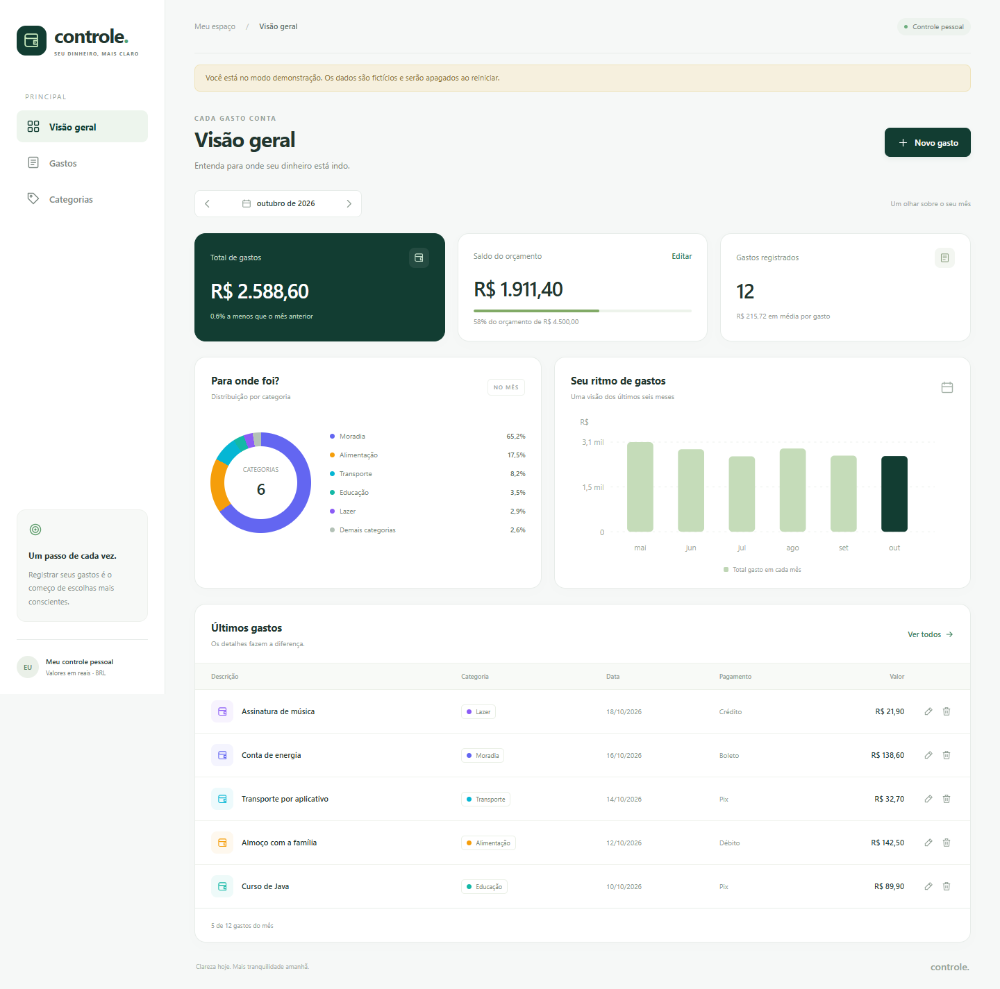

# Controle de Gastos

Aplicação web pessoal em **Java 21 + Spring Boot + MySQL**, com interface em português e valores em reais. Registre despesas, organize categorias e acompanhe o orçamento de cada mês.



## Funcionalidades

- Cadastro, edição e exclusão de gastos, com descrição, valor, data, categoria, pagamento e observações.
- Categorias com nome e cor; proteção contra nomes duplicados e exclusão de categorias em uso.
- Painel mensal com total, comparação com o mês anterior, saldo do orçamento e média por gasto.
- Gráfico por categoria e histórico dos últimos seis meses.
- Busca por descrição, filtro por categoria e intervalo de datas, com paginação.
- Exportação CSV do período filtrado, com acentos e proteção contra fórmulas em células.
- Orçamento mensal opcional, com indicação de limite ultrapassado.
- Migrações automáticas do banco, testes de integração e CI para H2 e MySQL.

## Experimentar agora no Windows

1. Baixe o pacote completo na [versão 1.0.0](https://github.com/eduardorota1113/controle-gastos-java/releases/tag/v1.0.0) e extraia o ZIP inteiro para uma pasta.
2. Tenha **Java 21** instalado (`java -version` deve mostrar 21 ou superior).
3. Dê dois cliques em **iniciar-demo.cmd**.
4. Aguarde a mensagem `Started ControleGastosApplication` e abra **http://localhost:8080**.
5. Encerre com `Ctrl+C` na janela do terminal.

O ZIP inclui o JAR pronto em `app/`. Se ele não existir, o script compila o código com o Maven Wrapper, exigindo JDK e internet na primeira execução. O modo **demo usa H2 em memória**: seus registros desaparecem ao reiniciar. Os dados fictícios incluem gastos em diferentes datas do mês selecionado, inclusive datas futuras.

Para executar o código-fonte diretamente no PowerShell:

```powershell
.\mvnw.cmd spring-boot:run "-Dspring-boot.run.profiles=demo"
```

No Linux/macOS:

```bash
bash mvnw spring-boot:run -Dspring-boot.run.profiles=demo
```

## Usar MySQL e guardar seus gastos

Requisitos: **JDK 21**, **MySQL 8.0.16+ ou 8.4** e internet na primeira compilação. O projeto inclui o Maven Wrapper; não é necessário instalar Maven separadamente. Se o Wrapper pedir `JAVA_HOME`, configure-o para a pasta do JDK.

1. Abra `database/setup.sql` no **MySQL Workbench**.
2. Substitua a senha de exemplo por uma senha sua e execute o script com um usuário administrador. Ele cria o banco `controle_gastos` e o usuário `controle_app`. Se esse usuário já existir, configure a senha dele pelo administrador antes de prosseguir.
3. No PowerShell, dentro da pasta do projeto, execute:

```powershell
$env:DB_USERNAME = "controle_app"
$env:DB_PASSWORD = "SUA_SENHA"
.\mvnw.cmd spring-boot:run
```

Por padrão, o sistema conecta ao MySQL em `localhost:3306`. Para outra porta ou outro banco, configure `DB_URL`:

```powershell
$env:DB_URL = "jdbc:mysql://localhost:3308/controle_gastos?connectionTimeZone=America/Sao_Paulo&characterEncoding=UTF-8"
```

Abra **http://localhost:8080**. O Flyway cria as tabelas e sete categorias iniciais. O banco começa **sem gastos**. Os dados ficam no MySQL ao encerrar ou reiniciar a aplicação.

O Java executado diretamente não carrega `.env` automaticamente. Use as variáveis do terminal. Nunca coloque senhas no código nem no GitHub.

## Executar com Docker Compose

Se você tiver Docker instalado:

```powershell
Copy-Item .env.example .env
# Edite .env e substitua as duas senhas de exemplo.
docker compose up --build -d
```

Acesse **http://localhost:8080**. O MySQL desse ambiente usa a porta local **3308**, para evitar conflito com uma instalação na porta 3306. Os dados ficam no volume `mysql_data`. Para parar preservando os dados, use `docker compose down`. Não remova o volume se quiser manter seus gastos.

As opções `allowPublicKeyRetrieval=true` e `useSSL=false` do Compose e do CI destinam-se à rede de desenvolvimento. Para um banco remoto, configure conexão com TLS validado conforme seu servidor.

## Testar e gerar o executável

```powershell
.\mvnw.cmd verify
java -jar target/controle-gastos-1.0.0.jar --spring.profiles.active=demo
```

Os testes padrão usam H2 em modo MySQL. Para testar com **um banco MySQL exclusivo de testes**, defina:

```powershell
$env:TEST_DB_URL = "jdbc:mysql://localhost:3306/controle_test"
$env:TEST_DB_USERNAME = "USUARIO_DE_TESTE"
$env:TEST_DB_PASSWORD = "SENHA_DE_TESTE"
.\mvnw.cmd test
```

O banco de testes deve existir e estar vazio na primeira execução. As migrações criam as tabelas; cada teste desfaz suas alterações. Nunca aponte `TEST_DB_URL` para um banco com gastos reais.

O GitHub Actions executa os testes em H2 e em MySQL 8.4 e disponibiliza o JAR como artefato de build. A execução desse workflow depende de publicar o repositório no GitHub. O arquivo `VALIDACAO.md` registra as verificações realizadas na entrega.

## Organização do código

```text
src/main/java/br/com/controle/gastos/
  api/       endpoints, entradas validadas e respostas de erro
  domain/    regras de negócio, consultas SQL e transações
  config/    cabeçalhos HTTP e dados exclusivos de demonstração
src/main/resources/
  db/migration/  esquema versionado pelo Flyway
  static/        interface HTML, CSS e JavaScript
src/test/        testes de integração da API com banco real de testes
database/        preparação do banco MySQL local
.github/         testes automáticos para o GitHub
```

Os valores usam `BigDecimal` no Java e `DECIMAL(12,2)` no banco. As consultas parametrizadas evitam interpolar entradas em SQL. A exclusão de gastos exige confirmação na interface. Gastos podem ter datas futuras, para registrar despesas planejadas; o resumo considera a data informada.

Este sistema é para **uso pessoal local, de um único usuário**, sem login. Por padrão, aceita conexões apenas em `127.0.0.1`, e o Compose também publica portas somente nesse endereço. Para disponibilizá-lo para várias pessoas na internet, implemente autenticação, separação dos dados por usuário e HTTPS antes de mudar essa configuração.

## API

| Método | Caminho | Função |
|---|---|---|
| GET | `/api/info` | Informações e indicação de demonstração |
| GET / POST | `/api/categories` | Listar / criar categorias |
| PUT / DELETE | `/api/categories/{id}` | Editar / excluir categoria |
| GET / POST | `/api/expenses` | Listar / criar gastos |
| GET / PUT / DELETE | `/api/expenses/{id}` | Consultar / editar / excluir gasto |
| GET | `/api/expenses/export` | CSV com os filtros aplicados |
| GET | `/api/dashboard?month=2026-10` | Resumo mensal |
| PUT / DELETE | `/api/budgets/{AAAA-MM}` | Definir / remover orçamento |

Filtros de gastos: `from`, `to` (ambos em `AAAA-MM-DD`), `categoryId`, `search`, `page` (a partir de zero), `size` (1 a 100). Sem datas, retorna o mês atual. A exportação aceita até 10.000 registros; use um período menor para bases maiores. Datas e meses devem estar entre os anos 1900 e 9998.

Exemplo de cadastro:

```json
{
  "description": "Supermercado",
  "amount": "125.90",
  "date": "2026-10-01",
  "categoryId": 1,
  "paymentMethod": "PIX",
  "notes": "Compras da semana"
}
```

Pagamentos: `PIX`, `DEBITO`, `CREDITO`, `DINHEIRO`, `BOLETO`, `TRANSFERENCIA`. Campos inválidos retornam HTTP 400; registros ausentes, 404; conflitos, 409. A API exige JSON para gravações e rejeita solicitações de gravação vindas de outra origem.

## Código no GitHub

Repositório público: [eduardorota1113/controle-gastos-java](https://github.com/eduardorota1113/controle-gastos-java).

Para obter uma cópia do código com histórico Git:

```bash
git clone https://github.com/eduardorota1113/controle-gastos-java.git
cd controle-gastos-java
```

Os arquivos `.env`, os executáveis gerados e as pastas de build estão excluídos pelo `.gitignore`. O pacote executável fica na seção **Releases**. Não envie senhas nem dados financeiros reais.

Referências técnicas: [Spring Boot](https://docs.spring.io/spring-boot/3.5/) e [MySQL Connector/J](https://dev.mysql.com/doc/connector-j/en/connector-j-installing-maven.html).
